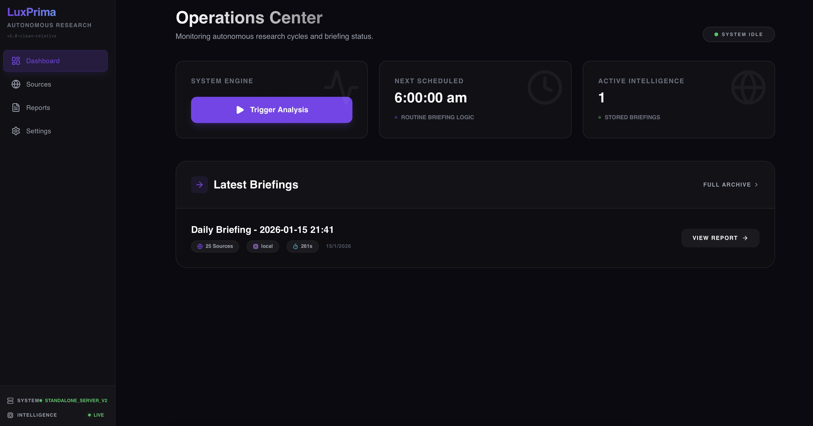
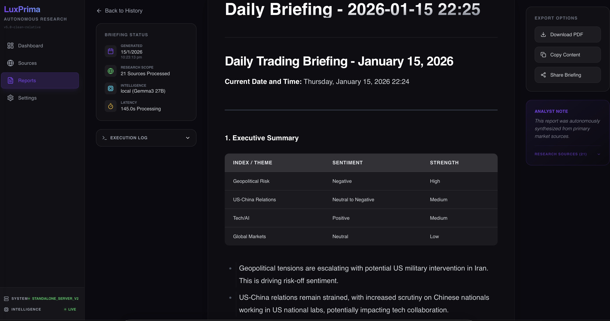
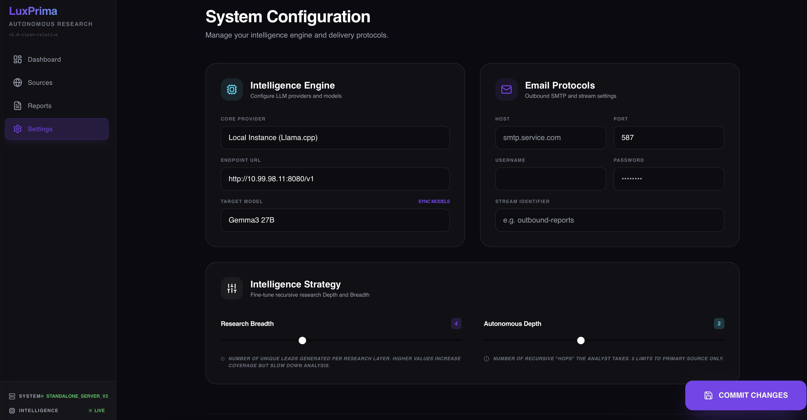
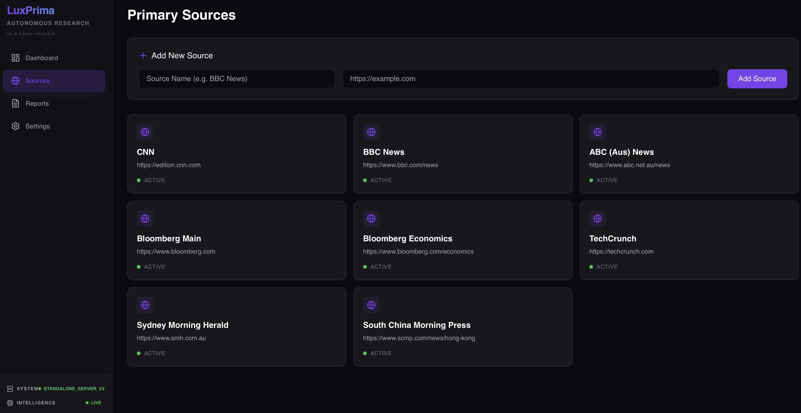

# LuxPrima: Autonomous Intelligence Engine 🌌

> **Note:** This is a hobby project built for personal use and small-scale deployments. It has only been tested with 1-2 users and primarily with local LLMs. If you're planning to use it at scale or with cloud providers, you'll likely need to do some additional work. **Contributions are very welcome!** If you fix bugs or add features, please consider contributing them back upstream. 🙏

LuxPrima is a self-hosted intelligence platform that automates web-based research and report generation. It uses large language models to orchestrate web crawling, information extraction, and synthesis of detailed markdown briefings.
---



## 🛠️ What It Does

- **Source Discovery & Extraction**: Uses headless browsing (Playwright) to navigate web sources and extract relevant information.
- **LLM Integration**: Works with local inference engines (Llama.cpp) or cloud providers (OpenAI, Google Gemini). **Note:** Most testing has been done with local LLMs.
- **Configurable Research**: Tune the depth (recursion levels) and breadth (number of sources) of your intelligence gathering.
- **Scheduled Automation**: Set up recurring research tasks that run automatically.
- **Report Generation**: Creates markdown reports and can deliver them via SMTP email.
- **Web Dashboard**: Monitor system status, configure settings, and review past reports.

## 🛠️ Tech Stack

### Backend
- **FastAPI**: High-performance Python framework
- **SQLAlchemy**: Database ORM
- **Playwright**: Headless browser automation
- **SMTP**: Email delivery

### Frontend
- **React (Vite)**: Modern web foundation
- **Tailwind CSS**: Utility-first styling
- **Framer Motion**: Smooth animations
- **Lucide React**: Icon library

## 🚀 Quick Start

### Prerequisites
- Docker & Docker Compose
- 
### Launch Locally
1. Clone the repository
2. Start the containers:
   ```bash
   docker compose up -d --build
   ```
3. Access the dashboard at `http://localhost:8081`

## 🌐 Server Deployment

For deploying to a network server or cloud instance, see [DEPLOYMENT.md](DEPLOYMENT.md).

## ⚠️ Important Notes

- **Small Scale Testing Only**: This has been developed and tested for 1-2 user deployments. Larger deployments may encounter issues.
- **Local LLM Focus**: Primary testing has been with local Llama.cpp instances. Cloud provider integrations (OpenAI, Gemini) are present but less thoroughly tested.
- **Under Active Development**: This is a personal project and may have rough edges.

## 🤝 Contributing

This is an open hobby project and **contributions are very welcome!** Whether it's:
- Bug fixes
- Performance improvements
- New features
- Better documentation
- Testing with different LLM providers
- Scaling improvements

If you make improvements, please consider opening a pull request so others can benefit. Even small fixes help!

## 📸 Interface Preview


---


---


---



---
*A personal project for autonomous intelligence gathering. Built for learning, shared for collaboration.*
